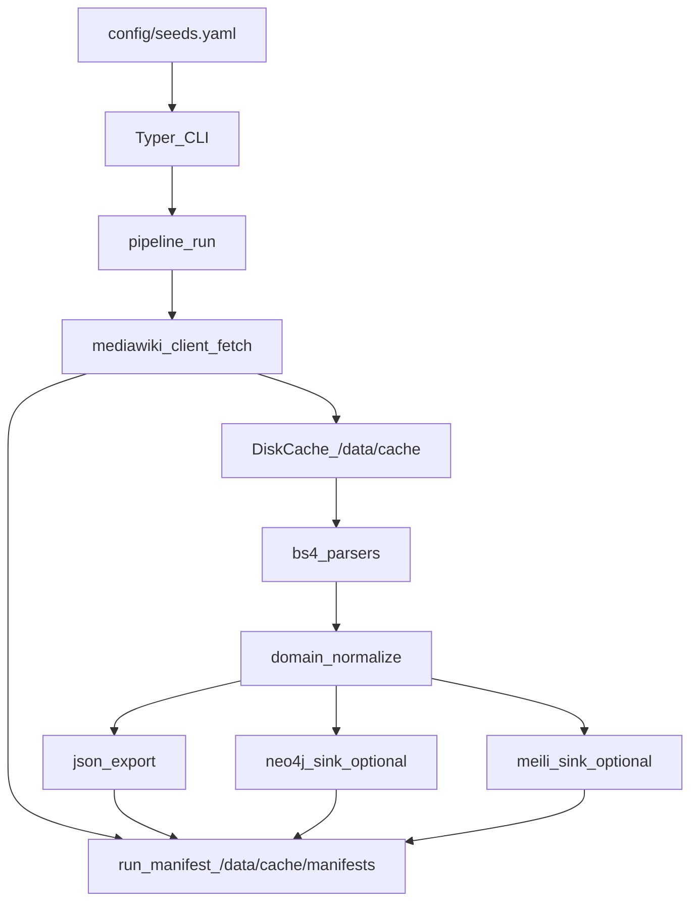

# WikipediaParlamenteScraper

Deterministisches, nachvollziehbares Scraping von Wikipedia-Parlamentsseiten mit persistenter Disk-Cache-Haltung, Offline-Tests, optionalen Sinks nach Neo4j und Meilisearch, und maximaler Reproduzierbarkeit/Provenance.

## Features

- **Deterministisches Scraping**: Reproduzierbare Ergebnisse durch deterministische Seeds und UUID5-basierte IDs
- **Provenance Tracking**: Jede Entität verlinkt auf konkrete Evidence mit vollständiger Metadaten-Kette
- **Disk-Cache**: Persistente Speicherung aller MediaWiki-Responses für Offline-Tests und Reproduzierbarkeit
- **Idempotenz**: Cache-basierte Refetch-Verhinderung, Upserts ohne Duplikate
- **MediaWiki API only**: Kein Browser-Scraping, ausschließlich MediaWiki API
- **Optional Sinks**: Neo4j und Meilisearch Integration
- **DIP Integration**: Bundestag-Daten via DIP OpenAPI
- **Identity Resolution**: Deterministische Zusammenführung von Wikipedia- und DIP-Personen
- **Seed Discovery**: Automatische Entdeckung von Landtags-Mitgliederlisten aus Registry-Konfiguration

## Quick Start

**Siehe [QUICKSTART.md](QUICKSTART.md) für eine komplette Schritt-für-Schritt-Anleitung.**

**Kurzfassung:**
1. **Seeds entdecken**: `docker compose run --rm scraper scraper seed --discover --landtage --pin-revisions`
2. **Alles laden**: `docker compose run --rm scraper scraper pipeline --ingest-dip --reconcile --write-neo4j --write-meili`

## Datenfluss



## Quick Start

### 1. Seeds für alle Landtage automatisch entdecken

```bash
# Services starten
docker compose up -d neo4j meilisearch

# Seeds für alle 16 Landtage automatisch entdecken
docker compose run --rm scraper scraper seed --discover --landtage --pin-revisions

# Output: data/exports/seeds_landtage.yaml (167+ Seeds)
```

### 2. Bundestag + Landtag Daten laden

```bash
# Environment-Variablen setzen (falls noch nicht geschehen)
# DIP_API_KEY in .env setzen für Bundestag-Daten

# Pipeline mit Bundestag (alle Wahlperioden) + Landtag (alle Seeds) ausführen
docker compose run --rm scraper scraper pipeline \
  --ingest-dip \
  --reconcile \
  --write-neo4j \
  --write-meili \
  --force

# Oder für einen einzelnen Landtag-Seed:
docker compose run --rm scraper scraper pipeline \
  --seed be_ah_1 \
  --ingest-dip \
  --reconcile \
  --write-neo4j \
  --write-meili
```

**Was passiert:**
1. **DIP Ingest**: Lädt alle Bundestags-Personen (Wahlperioden 1-50, konfigurierbar via `DIP_MAX_WAHLPERIODE`)
2. **Wikipedia Scraping**: Lädt Landtags-Mitgliederlisten aus Wikipedia
3. **Reconciliation**: Führt Wikipedia- und DIP-Personen zusammen (Identity Resolution)
4. **Sinks**: Speichert in Neo4j und Meilisearch

**Ohne `--force` (idempotent, nutzt Cache):**
```bash
docker compose run --rm scraper scraper pipeline \
  --ingest-dip \
  --reconcile \
  --write-neo4j \
  --write-meili
```

## Setup

### Voraussetzungen

- Docker & Docker Compose
- Python 3.12+ (für lokale Entwicklung)
- uv (Python Package Manager)

### Installation

1. Repository klonen:
```bash
git clone <repository-url>
cd wikipedia-parlamente-scraper
```

2. Environment-Variablen konfigurieren:
```bash
cp .env.example .env
# Bearbeite .env nach Bedarf
# Wichtig: DIP_API_KEY setzen für Bundestag-Daten
# DIP_MAX_WAHLPERIODE=50  # Maximum Wahlperiode (default: 50, lädt alle WPs 1-50)
```

3. Services starten:
```bash
docker compose up -d neo4j meilisearch
```

4. Seeds entdecken (siehe Quick Start oben)

5. Pipeline ausführen (siehe Quick Start oben)

## Verwendung

### CLI Commands

#### Seeds verwalten
```bash
# Seeds validieren
scraper seed --validate

# Seeds für alle Landtage automatisch entdecken
scraper seed --discover --landtage [--registry config/landtage_registry.yaml] [--output config/seeds_landtage.yaml] [--pin-revisions] [--force]
```

**Seed Discovery:**
- Durchsucht Wikipedia automatisch nach Mitgliederlisten aller 16 Landtage
- Validiert, dass gefundene Seiten tatsächlich Member-Listen mit Name/Partei/Wahlkreis enthalten
- Erzeugt deterministische Seeds im bestehenden Format
- Optional: Pinnt `page_id` und `revision_id` für Reproduzierbarkeit
- Nutzt denselben Disk-Cache wie normale Fetches
- Output: `config/seeds_landtage.yaml` (kann mit bestehenden Seeds kombiniert werden)

#### Einzelne Seite fetchen
```bash
# Legislature
scraper fetch legislature --seed nds_lt_17 [--force] [--revalidate]

# Person
scraper fetch person --title "Max_Mustermann" [--force] [--revalidate]
```

#### Parsen
```bash
scraper parse legislature --seed nds_lt_17
```

#### DIP Ingest
```bash
# Personen für Wahlperioden 19-20 ingestieren
scraper dip ingest persons --from-wp 19 --to-wp 20 [--detail] [--force]
```

#### Identity Resolution (Reconciliation)
```bash
# Wikipedia und DIP zusammenführen
scraper reconcile wiki-dip --seed nds_lt_17 [--use-overrides] [--write-neo4j] [--write-meili]
```

#### Pipeline ausführen
```bash
# Einzelner Seed mit DIP + Reconciliation
scraper pipeline --seed nds_lt_17 --ingest-dip --reconcile --dip-wahlperiode 19 --write-neo4j --write-meili

# Standard Pipeline (nur Wikipedia)
scraper pipeline --seed nds_lt_17 [--write-neo4j] [--write-meili] [--force] [--revalidate]
```

#### Export
```bash
scraper export json --out /data/exports/<run_id>/
```

## Cache-Struktur

```
data/cache/
├── mediawiki/
│   └── <safe_title>/
│       ├── <revision_id>/
│       │   └── parse/
│       │       ├── raw.json
│       │       └── metadata.json
│       └── latest.json
├── dip/
│   └── <safe_endpoint>/
│       ├── <params_hash>/
│       │   ├── raw.json
│       │   └── metadata.json
│       └── latest.json
└── manifests/
    └── <run_id>.json
```

## Seeds Konfiguration

Die Seeds werden in `config/seeds.yaml` definiert:

```yaml
nds_lt_17:
  key: nds_lt_17
  page_title: "Liste der Mitglieder des Niedersächsischen Landtages (17. Wahlperiode)"
  expected_time_range:
    start: "2013-01-20"
    end: "2017-11-14"
  hints:
    parliament: "Niedersächsischer Landtag"
    state: "Niedersachsen"
    legislature_number: 17
    section_keywords:
      - "Mitglieder"
      - "Abgeordnete"
```

## Identity Resolution (Phase 2)

### Konzept

Das System führt Wikipedia-Personen und DIP-Personen (Deutscher Bundestag) deterministisch zusammen:

- **CanonicalPerson**: Interne, kanonische Person-Entität mit Identifiers aus beiden Quellen
- **Source Records**: WikipediaPersonRecord und DipPersonRecord behalten ihre Provenance
- **LinkAssertion**: Auditierbare Verbindungen zwischen Quellen mit Status (accepted/pending/rejected)

### Ruleset v1

Deterministische Matching-Regeln:
1. Name-Normalisierung (lowercase, whitespace, Umlaute)
2. Scoring: exact match (nachname, vorname) => 1.0, partial => 0.95
3. Entscheidung: Nur eindeutige Matches (score >= 0.95, Abstand >= 0.05) werden automatisch accepted
4. Ambiguität => pending (keine automatische Zusammenführung)

### Manual Overrides

`config/link_overrides.yaml` ermöglicht manuelle Zuordnungen:

```yaml
overrides:
  "Wikipedia_Title":
    dip_person_id: 12345
    status: "accepted"  # or "rejected"
    reason: "Manual override"
```

### Workflow

1. **DIP Ingest**: `scraper dip ingest persons --from-wp 19 --to-wp 20`
2. **Wikipedia Scraping**: `scraper pipeline --seed nds_lt_17`
3. **Reconciliation**: `scraper reconcile wiki-dip --seed nds_lt_17 --write-neo4j`
4. **Review Pending**: Manuelle Prüfung und Overrides in `link_overrides.yaml`
5. **Re-run**: Reconciliation erneut ausführen mit Overrides

## Provenance & Evidence

Jede extrahierte Entität enthält:
- `evidence_ids[]`: Liste von Evidence-IDs
- `provenance`: Zusammenfassung mit `page_id`, `page_title`, `source_url`, `revision_id`, `retrieved_at`, `sha256`

Evidence-Objekte enthalten:
- `id`: Deterministische UUID5-ID
- `endpoint_kind`: "parse" oder "query"
- `page_title`, `page_id`, `revision_id`
- `source_url`, `retrieved_at`, `sha256`
- `snippet_ref`: Optionaler Verweis auf spezifisches Snippet

## Tests

Alle Tests sind offline und verwenden gecachte Fixtures:

```bash
pytest -q
```

Tests befinden sich in `tests/`:
- `test_seed_validation.py`: Seed-Schema-Validierung
- `test_cache_paths_and_manifest.py`: Cache-Pfad-Logik
- `test_parse_legislature_members_nds_17.py`: Parser-Test für 17. WP
- `test_parse_legislature_members_nds_18.py`: Parser-Test für 18. WP
- `test_parse_person_infobox.py`: Person-Page-Parser-Test
- `test_dip_pagination_and_cache.py`: DIP Pagination und Cache
- `test_reconcile_ruleset_v1_unique_match.py`: Reconciliation eindeutiger Match
- `test_reconcile_ruleset_v1_ambiguous_pending.py`: Reconciliation Ambiguität
- `test_link_overrides_apply.py`: Manual Overrides

## Troubleshooting

### Rate Limit

Wenn MediaWiki Rate-Limiting auftritt:
- `SCRAPER_RATE_LIMIT_RPS` in `.env` reduzieren (Standard: 2.0)
- Warten zwischen Requests erhöhen

### Revalidate

Um zu prüfen, ob eine Seite aktualisiert wurde:
```bash
scraper fetch legislature --seed nds_lt_17 --revalidate
```

### Neo4j Connectivity

Prüfen, ob Neo4j läuft:
```bash
docker compose ps neo4j
```

Neo4j Browser: http://localhost:7474

### Meilisearch Connectivity

Prüfen, ob Meilisearch läuft:
```bash
docker compose ps meilisearch
```

Health Check: http://localhost:7700/health

### Cache Invalidation

Cache komplett löschen:
```bash
rm -rf data/cache/mediawiki/*
```

Einzelne Seite neu fetchen:
```bash
scraper fetch legislature --seed nds_lt_17 --force
```

## Projektstruktur

```
.
├── config/
│   └── seeds.yaml              # Deterministische Seeds
├── src/scraper/
│   ├── cli.py                  # Typer Entrypoint
│   ├── config.py               # Settings
│   ├── logging.py              # JSON Logging
│   ├── utils/
│   │   ├── ids.py              # UUID5 deterministische IDs
│   │   ├── hashing.py          # SHA256
│   │   └── time.py             # UTC helpers
│   ├── cache/
│   │   └── mediawiki_cache.py  # Disk Cache + Manifest
│   ├── mediawiki/
│   │   ├── client.py           # httpx Client
│   │   └── types.py            # Typed DTOs
│   ├── parsers/
│   │   ├── legislature_members.py
│   │   └── person_page.py
│   ├── models/
│   │   └── domain.py           # Pydantic Models
│   ├── pipeline/
│   │   └── run.py              # Pipeline Orchestration
│   └── sinks/
│       ├── json_export.py
│       ├── neo4j.py
│       └── meili.py
│   ├── sources/
│   │   └── dip/
│   │       ├── client.py
│   │       ├── types.py
│   │       └── ingest.py
│   └── reconcile/
│       └── wiki_dip.py
├── tests/
│   ├── fixtures/
│   │   └── mediawiki/          # Gecachte Responses
│   └── test_*.py
├── Dockerfile
├── docker-compose.yml
├── .env.example
└── README.md
```

## Akzeptanzkriterien (MVP)

✅ `docker compose up -d neo4j meilisearch` läuft; Volumes unter `./data/*` werden befüllt

✅ `docker compose run --rm scraper scraper pipeline run --seed nds_lt_17` erzeugt:
- Raw Cache unter `./data/cache/...`
- Export unter `./data/exports/<run_id>/...`
- Manifest unter `./data/cache/manifests/<run_id>.json`

✅ Wiederholter Run ist idempotent: Cache wird genutzt; keine Duplikate in Neo4j/Meili

✅ Meili Query nach einem enthaltenen Namen findet Person, inkl. `evidence_ids[]`

✅ Tests laufen offline: `pytest -q` ist grün

## Lizenz

[Lizenz hier einfügen]

