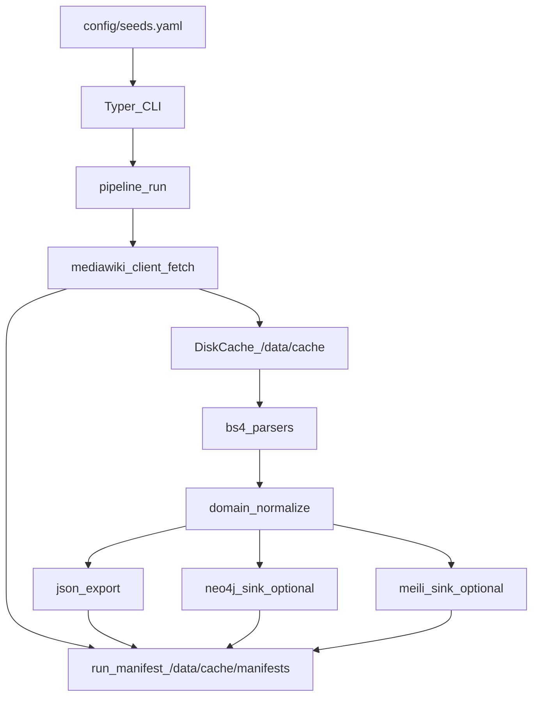

# WikipediaParlamenteScraper

Deterministisches, nachvollziehbares Scraping von Wikipedia-Parlamentsseiten mit persistenter Disk-Cache-Haltung, Offline-Tests, optionalen Sinks nach Neo4j und Meilisearch, und maximaler Reproduzierbarkeit/Provenance.

## Features

- **Deterministisches Scraping**: Reproduzierbare Ergebnisse durch deterministische Seeds und UUID5-basierte IDs
- **Provenance Tracking**: Jede Entität verlinkt auf konkrete Evidence mit vollständiger Metadaten-Kette
- **Disk-Cache**: Persistente Speicherung aller MediaWiki-Responses für Offline-Tests und Reproduzierbarkeit
- **Idempotenz**: Cache-basierte Refetch-Verhinderung, Upserts ohne Duplikate
- **MediaWiki API only**: Kein Browser-Scraping, ausschließlich MediaWiki API
- **Optional Sinks**: Neo4j und Meilisearch Integration

## Datenfluss



## Setup

### Voraussetzungen

- Docker & Docker Compose
- Python 3.12+ (für lokale Entwicklung)
- uv (Python Package Manager)

### Installation

1. Repository klonen:
```bash
git clone <repository-url>
cd wikipedia-parlamente-scraper
```

2. Environment-Variablen konfigurieren:
```bash
cp .env.example .env
# Bearbeite .env nach Bedarf
```

3. Services starten:
```bash
docker compose up -d neo4j meilisearch
```

4. Scraper ausführen:
```bash
# Seeds validieren
docker compose run --rm scraper scraper seed validate

# Pipeline für einen Seed ausführen
docker compose run --rm scraper scraper pipeline run --seed nds_lt_17 --write-neo4j --write-meili
```

## Verwendung

### CLI Commands

#### Seeds validieren
```bash
scraper seed validate
```

#### Einzelne Seite fetchen
```bash
# Legislature
scraper fetch legislature --seed nds_lt_17 [--force] [--revalidate]

# Person
scraper fetch person --title "Max_Mustermann" [--force] [--revalidate]
```

#### Parsen
```bash
scraper parse legislature --seed nds_lt_17
```

#### Pipeline ausführen
```bash
# Einzelner Seed
scraper pipeline run --seed nds_lt_17 [--write-neo4j] [--write-meili] [--force] [--revalidate]

# Alle Seeds
scraper pipeline run-all [--write-neo4j] [--write-meili] [--force] [--revalidate]
```

#### Export
```bash
scraper export json --out /data/exports/<run_id>/
```

## Cache-Struktur

```
data/cache/
├── mediawiki/
│   └── <safe_title>/
│       ├── <revision_id>/
│       │   └── parse/
│       │       ├── raw.json
│       │       └── metadata.json
│       └── latest.json
└── manifests/
    └── <run_id>.json
```

## Seeds Konfiguration

Die Seeds werden in `config/seeds.yaml` definiert:

```yaml
nds_lt_17:
  key: nds_lt_17
  page_title: "Liste der Mitglieder des Niedersächsischen Landtages (17. Wahlperiode)"
  expected_time_range:
    start: "2013-01-20"
    end: "2017-11-14"
  hints:
    parliament: "Niedersächsischer Landtag"
    state: "Niedersachsen"
    legislature_number: 17
    section_keywords:
      - "Mitglieder"
      - "Abgeordnete"
```

## Provenance & Evidence

Jede extrahierte Entität enthält:
- `evidence_ids[]`: Liste von Evidence-IDs
- `provenance`: Zusammenfassung mit `page_id`, `page_title`, `source_url`, `revision_id`, `retrieved_at`, `sha256`

Evidence-Objekte enthalten:
- `id`: Deterministische UUID5-ID
- `endpoint_kind`: "parse" oder "query"
- `page_title`, `page_id`, `revision_id`
- `source_url`, `retrieved_at`, `sha256`
- `snippet_ref`: Optionaler Verweis auf spezifisches Snippet

## Tests

Alle Tests sind offline und verwenden gecachte Fixtures:

```bash
pytest -q
```

Tests befinden sich in `tests/`:
- `test_seed_validation.py`: Seed-Schema-Validierung
- `test_cache_paths_and_manifest.py`: Cache-Pfad-Logik
- `test_parse_legislature_members_nds_17.py`: Parser-Test für 17. WP
- `test_parse_legislature_members_nds_18.py`: Parser-Test für 18. WP
- `test_parse_person_infobox.py`: Person-Page-Parser-Test

## Troubleshooting

### Rate Limit

Wenn MediaWiki Rate-Limiting auftritt:
- `SCRAPER_RATE_LIMIT_RPS` in `.env` reduzieren (Standard: 2.0)
- Warten zwischen Requests erhöhen

### Revalidate

Um zu prüfen, ob eine Seite aktualisiert wurde:
```bash
scraper fetch legislature --seed nds_lt_17 --revalidate
```

### Neo4j Connectivity

Prüfen, ob Neo4j läuft:
```bash
docker compose ps neo4j
```

Neo4j Browser: http://localhost:7474

### Meilisearch Connectivity

Prüfen, ob Meilisearch läuft:
```bash
docker compose ps meilisearch
```

Health Check: http://localhost:7700/health

### Cache Invalidation

Cache komplett löschen:
```bash
rm -rf data/cache/mediawiki/*
```

Einzelne Seite neu fetchen:
```bash
scraper fetch legislature --seed nds_lt_17 --force
```

## Projektstruktur

```
.
├── config/
│   └── seeds.yaml              # Deterministische Seeds
├── src/scraper/
│   ├── cli.py                  # Typer Entrypoint
│   ├── config.py               # Settings
│   ├── logging.py              # JSON Logging
│   ├── utils/
│   │   ├── ids.py              # UUID5 deterministische IDs
│   │   ├── hashing.py          # SHA256
│   │   └── time.py             # UTC helpers
│   ├── cache/
│   │   └── mediawiki_cache.py  # Disk Cache + Manifest
│   ├── mediawiki/
│   │   ├── client.py           # httpx Client
│   │   └── types.py            # Typed DTOs
│   ├── parsers/
│   │   ├── legislature_members.py
│   │   └── person_page.py
│   ├── models/
│   │   └── domain.py           # Pydantic Models
│   ├── pipeline/
│   │   └── run.py              # Pipeline Orchestration
│   └── sinks/
│       ├── json_export.py
│       ├── neo4j.py
│       └── meili.py
├── tests/
│   ├── fixtures/
│   │   └── mediawiki/          # Gecachte Responses
│   └── test_*.py
├── Dockerfile
├── docker-compose.yml
├── .env.example
└── README.md
```

## Akzeptanzkriterien (MVP)

✅ `docker compose up -d neo4j meilisearch` läuft; Volumes unter `./data/*` werden befüllt

✅ `docker compose run --rm scraper scraper pipeline run --seed nds_lt_17` erzeugt:
- Raw Cache unter `./data/cache/...`
- Export unter `./data/exports/<run_id>/...`
- Manifest unter `./data/cache/manifests/<run_id>.json`

✅ Wiederholter Run ist idempotent: Cache wird genutzt; keine Duplikate in Neo4j/Meili

✅ Meili Query nach einem enthaltenen Namen findet Person, inkl. `evidence_ids[]`

✅ Tests laufen offline: `pytest -q` ist grün

## Lizenz

[Lizenz hier einfügen]

