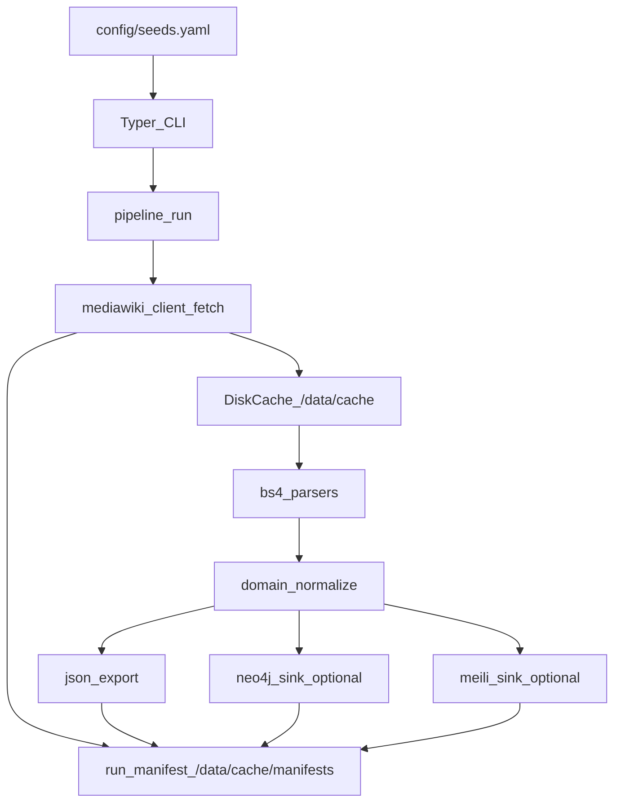

# WikipediaParlamenteScraper

Deterministisches, nachvollziehbares Scraping von Wikipedia-Parlamentsseiten mit persistenter Disk-Cache-Haltung, Offline-Tests, optionalen Sinks nach Neo4j und Meilisearch, und maximaler Reproduzierbarkeit/Provenance.

## Features

- **Deterministisches Scraping**: Reproduzierbare Ergebnisse durch deterministische Seeds und UUID5-basierte IDs
- **Provenance Tracking**: Jede Entität verlinkt auf konkrete Evidence mit vollständiger Metadaten-Kette
- **Disk-Cache**: Persistente Speicherung aller MediaWiki-Responses für Offline-Tests und Reproduzierbarkeit
- **Idempotenz**: Cache-basierte Refetch-Verhinderung, Upserts ohne Duplikate
- **MediaWiki API only**: Kein Browser-Scraping, ausschließlich MediaWiki API
- **Optional Sinks**: Neo4j und Meilisearch Integration
- **DIP Integration**: Bundestag-Daten via DIP OpenAPI
- **Identity Resolution**: Deterministische Zusammenführung von Wikipedia- und DIP-Personen
- **Seed Discovery**: Automatische Entdeckung von Landtags-Mitgliederlisten aus Registry-Konfiguration
- **Strict Day-Only Dates**: `Legislature.start_date` wird nur bei day-Precision gesetzt (konstituierende Sitzung/erste Sitzung), sonst bleiben `*_date = null` und `*_raw`/`*_precision` werden befüllt
- **Wikidata Term Ingestion**: Automatische Extraktion von day-precision Term-Startdaten aus Wikidata (revision-pinned)
- **Constituting Session Extraction**: Automatische Extraktion von "konstituierende Sitzung" Daten aus Wikipedia-Mitgliederlisten (Lead-Text, oldid-pinned)
- **Completeness vs Integrity Validation**: Trennung zwischen Completeness-Gaps (WARNING) und Integrity-Fehlern (ERROR)

## Quick Start

**Siehe [QUICKSTART.md](QUICKSTART.md) für eine komplette Schritt-für-Schritt-Anleitung.**

**Kurzfassung:**
1. **Seeds entdecken**: `docker compose run --rm --build scraper scraper seed --discover --landtage --pin-revisions`
2. **ALLE Daten laden**: `docker compose run --rm --build scraper scraper pipeline --ingest-dip --reconcile --write-neo4j --write-meili --fetch-person-pages`
   - Lädt automatisch **ALLE** Seeds (167+ Landtags-Mitgliederlisten)
   - Lädt automatisch **ALLE** DIP Wahlperioden (1-50)
   - Lädt **ALLE** Personenseiten für vollständige Daten
3. **Legislature-Startdaten (day-only) propagieren**: siehe Schritt 2.5 in `QUICKSTART.md`

## Datenfluss


```mermaid
flowchart TD
  seeds[config/seeds.yaml] --> cli[Typer_CLI]
  cli --> run[pipeline_run]
  run --> fetch[mediawiki_client_fetch]
  fetch --> cache[DiskCache_/data/cache]
  cache --> parse[bs4_parsers]
  parse --> norm[domain_normalize]
  norm --> export[json_export]
  norm --> neo4j[neo4j_sink_optional]
  norm --> meili[meili_sink_optional]
  fetch --> manifest[run_manifest_/data/cache/manifests]
  export --> manifest
  neo4j --> manifest
  meili --> manifest
```

## Quick Start

**Siehe [QUICKSTART.md](QUICKSTART.md) für eine komplette Schritt-für-Schritt-Anleitung.**

## Setup

### Voraussetzungen

- Docker & Docker Compose
- Python 3.12+ (für lokale Entwicklung)
- uv (Python Package Manager)

### Installation

1. Repository klonen:
```bash
git clone <repository-url>
cd wikipedia-parlamente-scraper
```

2. Environment-Variablen konfigurieren:
```bash
cp .env.example .env
# Bearbeite .env nach Bedarf
```

**Wichtige ENV-Variablen:**
```bash
# DIP API (für Bundestag)
DIP_API_KEY=your_api_key_here
DIP_BASE_URL=https://search.dip.bundestag.de/api/v1
DIP_MAX_WAHLPERIODE=50  # Maximum Wahlperiode (default: 50)

# Neo4j
NEO4J_URI=bolt://neo4j:7687
NEO4J_USER=neo4j
NEO4J_PASSWORD=password

# Meilisearch
MEILI_URL=http://meilisearch:7700
MEILI_MASTER_KEY=masterKey

# LangGraph MVP (Ollama erforderlich)
PISS_TOOL_BASE_URL=http://localhost:8000/api/tools
PISS_OLLAMA_BASE_URL=http://192.168.178.185:11434/v1
PISS_OLLAMA_MODEL=ministral-3:14b
PISS_OPENAI_API_KEY=ollama
PISS_STRICT_EVIDENCE_DEFAULT=true
PISS_DEBUG=0  # Debug-Ausgabe für Healthcheck (0/1)

# LangGraph Orchestrator (optional)
PISS_TOOL_TIMEOUT_SECONDS=20
PISS_TOOL_STRICT_EVIDENCE=true
PISS_DEBUG_EXPLAIN_QUERIES=false
PISS_DEBUG_INCLUDE_RAW_TOOL_PAYLOADS=false
```

3. Services starten:
```bash
docker compose up -d neo4j meilisearch
```

4. Seeds entdecken (siehe Quick Start oben)

5. Pipeline ausführen (siehe Quick Start oben)

## Verwendung

### CLI Commands

#### Seeds verwalten
```bash
# Seeds validieren
scraper seed --validate

# Seeds für alle Landtage automatisch entdecken
scraper seed --discover --landtage [--registry config/landtage_registry.yaml] [--output config/seeds_landtage.yaml] [--pin-revisions] [--force]
```

**Seed Discovery:**
- Durchsucht Wikipedia automatisch nach Mitgliederlisten aller 16 Landtage
- Validiert, dass gefundene Seiten tatsächlich Member-Listen mit Name/Partei/Wahlkreis enthalten
- Erzeugt deterministische Seeds im bestehenden Format
- Optional: Pinnt `page_id` und `revision_id` für Reproduzierbarkeit
- Nutzt denselben Disk-Cache wie normale Fetches
- Output: `config/seeds_landtage.yaml` (kann mit bestehenden Seeds kombiniert werden)

#### Einzelne Seite fetchen
```bash
# Legislature
scraper fetch legislature --seed nds_lt_17 [--force] [--revalidate]

# Person
scraper fetch person --title "Max_Mustermann" [--force] [--revalidate]
```

#### Parsen
```bash
scraper parse legislature --seed nds_lt_17
```

#### DIP Ingest
```bash
# Personen für Wahlperioden 19-20 ingestieren
scraper dip ingest persons --from-wp 19 --to-wp 20 [--detail] [--force]
```

#### Identity Resolution (Reconciliation)
```bash
# Wikipedia und DIP zusammenführen
scraper reconcile wiki-dip --seed nds_lt_17 [--use-overrides] [--write-neo4j] [--write-meili]
```

#### Pipeline ausführen
```bash
# ALLES laden (ALLE Seeds + ALLE DIP Wahlperioden) - EMPFOHLEN
scraper pipeline --ingest-dip --reconcile --write-neo4j --write-meili --fetch-person-pages

# Einzelner Seed mit DIP + Reconciliation
scraper pipeline --seed nds_lt_17 --ingest-dip --reconcile --dip-wahlperiode "19,20" --write-neo4j --write-meili --fetch-person-pages

# Standard Pipeline (nur Wikipedia, alle Seeds)
scraper pipeline --write-neo4j --write-meili --fetch-person-pages

# Einzelner Seed (nur Wikipedia)
scraper pipeline --seed nds_lt_17 [--write-neo4j] [--write-meili] [--force] [--revalidate]
```

#### Enrichment-Queue
```bash
# Zeigt, welche Terms noch keine day-only start_date haben
python -m langgraph_app.cli list-missing-starts --format json [--out /tmp/missing.json]

# Zeigt Legislatures ohne start_date (mit Term-Informationen)
python -m langgraph_app.cli list-missing-legislature-starts --format json
```

#### Export
```bash
scraper export json --out /data/exports/<run_id>/
```

#### Evidence Resolver
```bash
# Resolve evidence IDs to canonical URLs and snippets
scraper evidence --resolve --ids <id1,id2,...> [--format json|yaml|md] [--with-snippets] [--max-len 500] [--prefer table_row|lead_paragraph]

# Resolve evidence from Meilisearch query (mit Row-level Citations)
scraper evidence --resolve-from-meili --query "Weil" --index persons [--limit 5] [--with-snippets] [--prefer table_row] [--format md]
```

#### Validator
```bash
# Default: Missing start_date = WARNING (completeness gap)
scraper validate [--json]

# Strict Completeness: Missing start_date = ERROR
scraper validate --strict-completeness [--json]

# Strict Evidence: Missing evidence = ERROR
scraper validate --strict [--json]

# Kombiniert
scraper validate --strict --strict-completeness [--json]
```

## LangGraph MVP: Members List CLI

Ein minimaler CLI-Runner für `members.list` Abfragen mit LLM-basierter Parameter-Extraktion:

**Siehe [langgraph_app/README.md](langgraph_app/README.md) für Details.**

**Kurzfassung:**
```bash
# Voraussetzung: Ollama muss laufen (PISS_OLLAMA_BASE_URL gesetzt)
# Preflight Healthcheck wird automatisch ausgeführt

# Einfache Abfrage
python -m langgraph_app.cli "Alle SPD-Mitglieder im Landtag Niedersachsen zwischen 2014-2020"

# Mit JSON Output
python -m langgraph_app.cli "Liste CDU im Bundestag 2018-2021" --format json

# Mit Markdown und Quellen pro Person
python -m langgraph_app.cli "Alle Grünen in Hessen 2020-2025" --format md --sources per-person

# Healthcheck-Optionen
python -m langgraph_app.cli --no-healthcheck "..."  # Healthcheck deaktivieren (nicht empfohlen)
python -m langgraph_app.cli --health-timeout 10.0 "..."  # Timeout anpassen
```

**Features:**
- LLM-basierte Parameter-Extraktion (Ollama erforderlich, alle 16 Bundesländer + Bundestag)
- Preflight Healthcheck (fail-fast bei Ollama-Fehlern)
- Automatische Pagination mit Merging/Deduplizierung
- Multiple Output-Formate (text, json, markdown)
- Konfigurierbare Quellen-Anzeige
- Verwendet `active_first_start_date`/`active_last_end_date` Felder

**Wichtig:** MVP benötigt Ollama für Parameter-Extraktion. Kein deterministischer Fallback mehr.

## Evidence Resolver

Der Evidence Resolver löst Evidence-IDs in zitierfähige Quellenobjekte auf:

- **Input**: Liste von Evidence-IDs (aus Meilisearch, Neo4j, Exports)
- **Output**: ResolvedEvidence Objekte mit:
  - Canonical URLs (Wikipedia mit `oldid` für Reproduzierbarkeit)
  - Snippets (optional, aus gecachtem HTML extrahiert)
  - Vollständige Provenance (revision_id, page_id, sha256, retrieved_at)
  - **Row-level Citations**: Für Mitgliederlisten werden Snippets aus der exakten Tabellenzeile extrahiert

### Row-level Citations (EvidenceRef Architecture)

Das System verwendet eine **zweistufige Architektur** für Evidence und Row-level Citations:

1. **Evidence (page-level)**: Unveränderlich, repräsentiert die gesamte Seite/Response
2. **EvidenceRef (entity-level)**: Entity-spezifische Referenz mit Row-level `snippet_ref`

Siehe [docs/provenance.md](docs/provenance.md) für Details.

#### Beispiel: Stephan Weil

**Mitgliederlisten-Evidence** (page-level):
- Evidence-ID: `98a37cb9-1cc5-51a1-a51e-5992856c4fa0`
- Page: "Liste der Mitglieder des Niedersächsischen Landtages (17. Wahlperiode)"
- **Kein** `snippet_ref` (page-level)

**Mandate EvidenceRef** (entity-level):
- `evidence_id`: `98a37cb9-1cc5-51a1-a51e-5992856c4fa0`
- `purpose`: `"membership_row"`
- `snippet_ref`: 
  ```json
  {
    "version": 1,
    "type": "table_row",
    "table_index": 0,
    "row_index": 5,
    "row_kind": "data",
    "match": {
      "person_title": "Stephan_Weil",
      "name_cell": "Stephan Weil"
    }
  }
  ```

**Resolver Output:**
```bash
docker compose run --rm --build scraper scraper evidence --resolve-from-meili \
  --query "Stephan Weil" \
  --index persons \
  --limit 1 \
  --with-snippets \
  --format md
```

**Output:**
```
Found 2 evidence references from Meilisearch (preferred)

- Evidence `98a37cb9-1cc5-51a1-a51e-5992856c4fa0`
  - **Source**: mediawiki
  - **Page**: Liste der Mitglieder des Niedersächsischen Landtages (17. Wahlperiode)
  - **Revision**: 256198867
  - **URL**: https://de.wikipedia.org/w/index.php?title=...&oldid=256198867
  - **Snippet**: "Stephan Weil | SPD | Wahlkreis Hannover-Linden | ..."
  - **Snippet Source**: table_row
  - **Purpose**: membership_row
  - **Snippet Ref**: ```json
    {
        "version": 1,
        "type": "table_row",
        "table_index": 0,
        "row_index": 5,
        "row_kind": "data",
        "match": {
            "person_title": "Stephan_Weil",
            "name_cell": "Stephan Weil"
        }
    }
    ```

- Evidence `b2c3d4e5-f6a7-89b0-c1d2-e3f4a5b6c7d8`
  - **Source**: mediawiki
  - **Page**: Stephan Weil
  - **Snippet Source**: lead_paragraph
  - **Purpose**: person_page_intro
  - **Snippet**: "Stephan Weil (* 15. März 1958 in Hamburg) ist ein deutscher Politiker (SPD)..."
```

#### Backward Compatibility

- **Legacy `evidence_ids`**: Bleiben nutzbar (Fallback `lead_paragraph`)
- **Neue `evidence_refs`**: Werden bevorzugt verwendet (mit `snippet_ref` für `table_row`)
- **Meilisearch**: Enthält beide (`evidence_ids` + `evidence_refs`)

#### CLI Optionen

- `--prefer table_row` (default): Wird ignoriert wenn `evidence_refs` vorhanden (nutzt `snippet_ref` aus EvidenceRef)
- `--prefer lead_paragraph`: Fallback für legacy `evidence_ids` ohne `evidence_refs`

#### Stabilität

- `snippet_ref` ist deterministisch bei gleicher `oldid`
- Wenn Wikipedia die Tabellenstruktur ändert, bleibt die gepinnte Revision (`oldid`) reproduzierbar
- `table_index` und `row_index` beziehen sich auf die gepinnte Revision
- **Wichtig**: Bei `resolve-from-meili` wird die **korrekte Tabellenzeile** geliefert (nicht die letzte verarbeitete Zeile)

### Warum `oldid` URLs wichtig sind

Wikipedia-Seiten ändern sich. Eine URL ohne `oldid` zeigt immer die aktuelle Version. Mit `oldid=<revision_id>` ist die URL reproduzierbar und zeigt exakt die Version, die beim Scraping vorhanden war.

**Format:**
- Mit `oldid`: `https://de.wikipedia.org/w/index.php?title=Stephan_Weil&oldid=123456789`
- Ohne `oldid`: `https://de.wikipedia.org/wiki/Stephan_Weil` (zeigt aktuelle Version)

### Evidence Index

Der Resolver nutzt einen Evidence Index (`/data/cache/index/evidence_index.jsonl`), der automatisch beim Schreiben in den Disk-Cache aktualisiert wird:

- **MediaWiki**: Beim Cachen von `action=parse` Responses
- **DIP**: Beim Cachen von DIP API Responses

Jede Zeile im Index enthält:
- `evidence_id`: Deterministische UUID5-ID
- `source_kind`: `mediawiki` oder `dip`
- `cache_metadata_path`: Pfad zu `metadata.json`
- `cache_raw_path`: Pfad zu `raw.json`
- `page_title`, `page_id`, `revision_id` (für MediaWiki)
- `sha256`: Hash des Response-Payloads

**Idempotenz**: Der Index wird idempotent aktualisiert (gleiche `evidence_id` überschreibt nicht, sondern aktualisiert).

### Offline-Verhalten

Der Resolver arbeitet vollständig offline:
- Liest aus dem Disk-Cache (keine HTTP-Requests)
- Nutzt den Evidence Index für schnelle Lookups
- Falls Index fehlt: Optionaler "best effort" Scan (langsam, nicht empfohlen)

### Snippet-Extraktion

Snippets werden aus dem gecachten HTML extrahiert:
- **Lead Paragraph**: Erster `<p>` mit ausreichend Inhalt (>= 80 Zeichen)
- **Table Row**: Falls `snippet_ref` vorhanden (z.B. `table_row:0:1`)
- **Cleaning**: Entfernt Fußnoten-Marker `[1]`, `[2]`, normalisiert Whitespace
- **Truncation**: Maximal `--max-len` Zeichen (default: 500)

## Cache-Struktur

```
data/cache/
├── mediawiki/
│   └── <safe_title>/
│       ├── <revision_id>/
│       │   └── parse/
│       │       ├── raw.json
│       │       └── metadata.json
│       └── latest.json
├── dip/
│   └── <safe_endpoint>/
│       ├── <params_hash>/
│       │   ├── raw.json
│       │   └── metadata.json
│       └── latest.json
├── index/
│   └── evidence_index.jsonl    # Evidence ID → Cache Path Mapping
└── manifests/
    └── <run_id>.json
```

## Seeds Konfiguration

Die Seeds werden in `config/seeds.yaml` definiert:

```yaml
nds_lt_17:
  key: nds_lt_17
  page_title: "Liste der Mitglieder des Niedersächsischen Landtages (17. Wahlperiode)"
  expected_time_range:
    start: "2013-01-20"
    end: "2017-11-14"
  hints:
    parliament: "Niedersächsischer Landtag"
    state: "Niedersachsen"
    legislature_number: 17
    section_keywords:
      - "Mitglieder"
      - "Abgeordnete"
```

## Identity Resolution (Phase 2)

### Konzept

Das System führt Wikipedia-Personen und DIP-Personen (Deutscher Bundestag) deterministisch zusammen:

- **CanonicalPerson**: Interne, kanonische Person-Entität mit Identifiers aus beiden Quellen
- **Source Records**: WikipediaPersonRecord und DipPersonRecord behalten ihre Provenance
- **LinkAssertion**: Auditierbare Verbindungen zwischen Quellen mit Status (accepted/pending/rejected)

### Ruleset v1

Deterministische Matching-Regeln:
1. Name-Normalisierung (lowercase, whitespace, Umlaute)
2. Scoring: exact match (nachname, vorname) => 1.0, partial => 0.95
3. Entscheidung: Nur eindeutige Matches (score >= 0.95, Abstand >= 0.05) werden automatisch accepted
4. Ambiguität => pending (keine automatische Zusammenführung)

### Manual Overrides

`config/link_overrides.yaml` ermöglicht manuelle Zuordnungen:

```yaml
overrides:
  "Wikipedia_Title":
    dip_person_id: 12345
    status: "accepted"  # or "rejected"
    reason: "Manual override"
```

### Workflow

1. **DIP Ingest**: `scraper dip ingest persons --from-wp 19 --to-wp 20`
2. **Wikipedia Scraping**: `scraper pipeline --seed nds_lt_17`
3. **Reconciliation**: `scraper reconcile wiki-dip --seed nds_lt_17 --write-neo4j`
4. **Review Pending**: Manuelle Prüfung und Overrides in `link_overrides.yaml`
5. **Re-run**: Reconciliation erneut ausführen mit Overrides

## Provenance & Evidence

Jede extrahierte Entität enthält Evidence-Referenzen mit vollständiger Provenance-Kette. Siehe [docs/provenance.md](docs/provenance.md) für Details.

## Tests

Alle Tests sind offline und verwenden gecachte Fixtures:

```bash
# Im Docker-Container
docker compose run --rm --build scraper pytest -q

# Spezifische Tests
docker compose run --rm --build scraper pytest tests/test_legislature_dates_extract.py -v
```

Tests befinden sich in `tests/`. Siehe [docs/IMPLEMENTATION_SUMMARY.md](docs/IMPLEMENTATION_SUMMARY.md) für Details.

## Reset & Reimport Workflow

Nach Code-Änderungen am Datenmodell (z.B. Parliament-Identifier, Evidence-Properties) kann ein vollständiger Reset + Reimport nötig sein:

### 1. Datenbank zurücksetzen

```bash
# Neo4j und Meilisearch zurücksetzen (mit Bestätigung)
docker compose run --rm --build scraper scraper reset-db --neo4j --meili

# Ohne Bestätigung (für Scripts)
docker compose run --rm --build scraper scraper reset-db --neo4j --meili --yes
```

**Was passiert:**
- **Neo4j**: Löscht alle Nodes und Relationships unserer Labels (Person, Parliament, Party, Legislature, Mandate, Evidence, etc.)
- **Meilisearch**: Löscht alle Indizes (persons, mandates)

**Wichtig:** Cache bleibt erhalten - Wikipedia/DIP-Responses werden nicht neu geladen.

### 2. Daten neu importieren

```bash
# Pipeline mit allen Seeds ausführen
docker compose run --rm --build scraper scraper pipeline \
  --write-neo4j \
  --write-meili \
  --fetch-person-pages
```

**Mit DIP + Reconciliation:**
```bash
docker compose run --rm --build scraper scraper pipeline \
  --ingest-dip \
  --reconcile \
  --write-neo4j \
  --write-meili \
  --fetch-person-pages
```

### 3. Smoke-Test (Laravel Tool API)

Nach dem Reimport sollte die Laravel Tool API `mandates.search` mit `strict_evidence=true` funktionieren:

```bash
# Beispiel: Mandate für Niedersachsen suchen
curl -X POST "http://localhost:8000/api/tools/mandates/search" \
  -H "Content-Type: application/json" \
  -H "Accept: application/json" \
  -d '{
    "parliament_id": "NI",
    "strict_evidence": true,
    "limit": 10
  }'
```

**Erwartetes Ergebnis:**
- Keine `EVIDENCE_MISSING` Fehler
- `evidence_urls` pro Row enthalten Wikipedia-URLs mit `oldid`
- `parliament_id` Filter funktioniert zuverlässig

#### Parliament Coverage Tool

Das `parliaments.coverage` Tool liefert Coverage-Statistiken pro Parliament:

```bash
# Alle Parlamente
curl -sS -X POST http://localhost:8000/api/tools/parliaments/coverage \
  -H "Content-Type: application/json" \
  -H "Accept: application/json" \
  -d '{}' | jq '.rows[:3]'

# Spezifische Parlamente
curl -sS -X POST http://localhost:8000/api/tools/parliaments/coverage \
  -H "Content-Type: application/json" \
  -H "Accept: application/json" \
  -d '{"parliament_ids": ["NI", "BT"]}' | jq '.rows'
```

**Response:**
```json
{
  "meta": {...},
  "applied_filter": {"parliament_ids": "all"},
  "rows": [
    {
      "parliament_id": "NI",
      "mandates_count": 3034,
      "min_start": "1947-04-20",
      "max_end": "2022-11-08",
      "invalid_start_count": 144,
      "invalid_end_count": 144,
      "missing_evidence_count": 0
    }
  ]
}
```

#### Active Only mit automatischem Stichtag

Das System nutzt Coverage automatisch, um den Stichtag zu clampen:

```bash
# Automatischer Stichtag (wird auf Datenstand geklemmt)
python -m langgraph_app.cli "Alle SPD-Mitglieder im Landtag Niedersachsen die noch ein aktives mandat haben"
# -> nutzt as_of = min(today, NI.max_end) = 2022-11-08

# Expliziter Stichtag (wird nicht geklemmt)
python -m langgraph_app.cli "Alle SPD-Mitglieder im Landtag Niedersachsen am 30.01.1990"
# -> nutzt exakt 1990-01-30, kein clamp
```

### 4. Validierung

```bash
# Datenqualität prüfen
docker compose run --rm --build scraper scraper validate --strict

# Spezifischen Parliament prüfen
docker compose run --rm --build scraper scraper validate --parliament NI --strict
```

## Troubleshooting

### Rate Limit

Wenn MediaWiki Rate-Limiting auftritt:
- `SCRAPER_RATE_LIMIT_RPS` in `.env` reduzieren (Standard: 2.0)
- Warten zwischen Requests erhöhen

### Revalidate

Um zu prüfen, ob eine Seite aktualisiert wurde:
```bash
scraper fetch legislature --seed nds_lt_17 --revalidate
```

### Neo4j Connectivity

Prüfen, ob Neo4j läuft:
```bash
docker compose ps neo4j
```

Neo4j Browser: http://localhost:7474

### Meilisearch Connectivity

Prüfen, ob Meilisearch läuft:
```bash
docker compose ps meilisearch
```

Health Check: http://localhost:7700/health

### Cache Invalidation

Cache komplett löschen:
```bash
rm -rf data/cache/mediawiki/*
```

Einzelne Seite neu fetchen:
```bash
scraper fetch legislature --seed nds_lt_17 --force
```

## Projektstruktur

```
.
├── config/
│   └── seeds.yaml              # Deterministische Seeds
├── src/scraper/
│   ├── cli.py                  # Typer Entrypoint
│   ├── config.py               # Settings
│   ├── logging.py              # JSON Logging
│   ├── utils/
│   │   ├── ids.py              # UUID5 deterministische IDs
│   │   ├── hashing.py          # SHA256
│   │   └── time.py             # UTC helpers
│   ├── cache/
│   │   └── mediawiki_cache.py  # Disk Cache + Manifest
│   ├── mediawiki/
│   │   ├── client.py           # httpx Client
│   │   └── types.py            # Typed DTOs
│   ├── parsers/
│   │   ├── legislature_members.py
│   │   └── person_page.py
│   ├── models/
│   │   └── domain.py           # Pydantic Models
│   ├── pipeline/
│   │   └── run.py              # Pipeline Orchestration
│   └── sinks/
│       ├── json_export.py
│       ├── neo4j.py
│       └── meili.py
│   ├── sources/
│   │   └── dip/
│   │       ├── client.py
│   │       ├── types.py
│   │       └── ingest.py
│   └── reconcile/
│       └── wiki_dip.py
├── tests/
│   ├── fixtures/
│   │   └── mediawiki/          # Gecachte Responses
│   └── test_*.py
├── Dockerfile
├── docker-compose.yml
├── .env.example
└── README.md
```

## Akzeptanzkriterien

✅ Vollständiger Workflow (siehe [QUICKSTART.md](QUICKSTART.md)):
- Seeds entdecken
- Pipeline ausführen (ALLE Seeds + ALLE DIP Wahlperioden)
- Legislature-Startdaten vervollständigen
- Validierung erfolgreich (Warnings OK, keine Errors)

✅ Deterministisch und reproduzierbar:
- Cache-basiert, oldid-pinned URLs
- UUID5-basierte IDs
- Vollständige Provenance-Kette

✅ Tests laufen offline: `pytest -q` ist grün

## Lizenz

[Lizenz hier einfügen]

